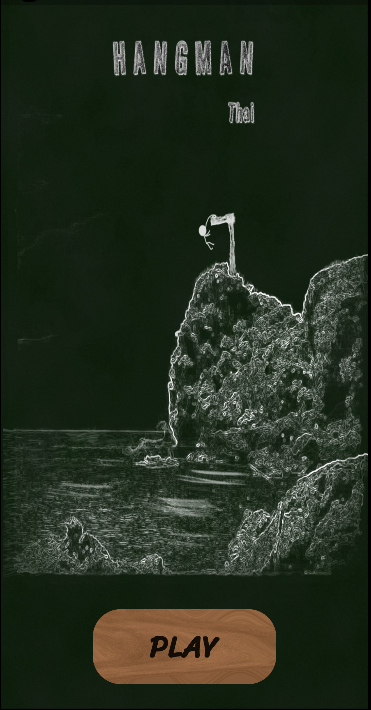
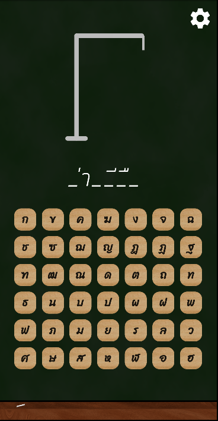
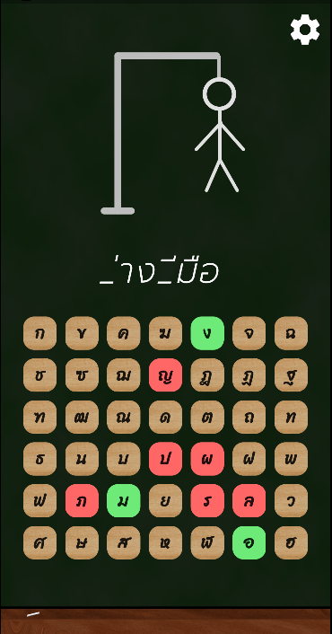
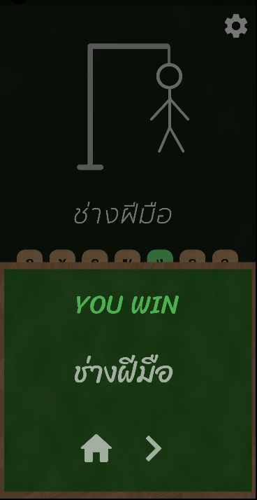
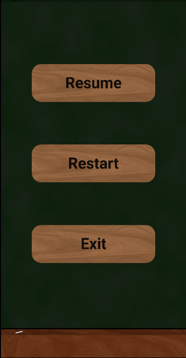

# Hangman

A hangman in Thai language. Build with [dart](https://flutter.dev/). Using [Flutter](https://flutter.dev/) framework.

## Basic rule 

You have There are 42 buttons of Thai alphabet.
We have about a thousand words to play with. 
You can guess as many letters as you want until you get 7 letters wrong then you will lose.

## Images

